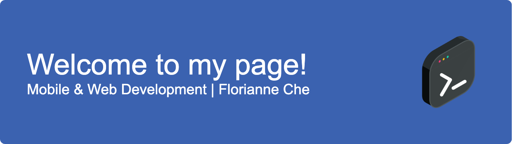

### 
### Hi there ✩ 🌊🎧 ✮ my name is Florianne Che
#### CS major @ UIC | Minors in Finance & Chinese

I love learning and teaching! My past experiences and projects include volunteer tutoring & building educational resources, including the app I am building for the Leaf Project to enhance financial literacy for women. Right now I am working on my personal website to develop my web design skills and showcase my various projects. When I'm not programming, I love to read classic literature, run, and draw comics! I am so excited to be another addition to the community of women in tech. 

- 🌨️ I’m working on building my personal website
- 🎧 I’m currently learning CSS and HTML
- 🎐 Fun fact: I'm reading Vilette by Charlotte Bronte

### Skills & Tools: C / C++ / JAVA / SWIFT / PYTHON

  

